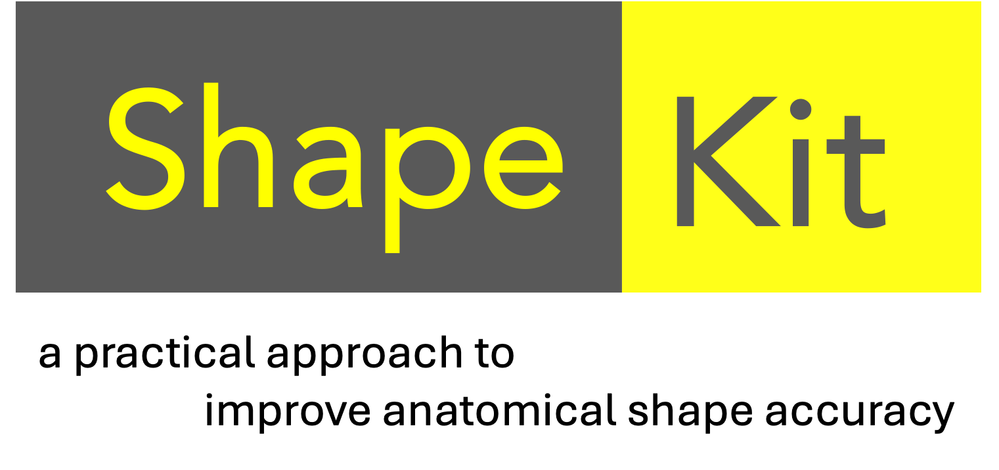

<!-- <h1 align="center">ShapeKit</h1> -->

<div align="center">
  
</div>

<!-- <div align="center">

 -->

<div align="center">


[](https://github.com/MrGiovanni/ShapeKit/stargazers)
<a href="https://twitter.com/bodymaps317">
        
</a><br/>  

</div>

**ShapeKit** is a flexible and easy-to-use toolkit for medical CT segmentation research. 

# Introduction

ShapeKit allows researchers and clinicians to correct segmentation errors in AI-predicted masks without the need to retrain models. Thanks to its plug-and-play design, ShapeKit can be seamlessly integrated into existing pipelines, making it a practical solution for improving segmentation quality across different organs and datasets.

This repository provides a parallelized Python pipeline for anatomical-aware post-processing of multi-organ medical image segmentations. The workflow includes combining, refining, and anatomically calibrating predicted segmentations to produce robust and consistent output suitable for downstream analysis.

Our documentation consists of the following sections:

* Paper: the publication paper of ShapeKit.
* News: updates on ShapeKit.
* Installation: for preparing the environment.
* Run ShapeKit: for applying the ShapeKit on the user-defined data.
* Key Functions: several major functions for processing common shape errors.
* Related Articles: related works.

# Paper

<b>ShapeKit</b> <br/>
Junqi Liu*, Dongli He*, [Wenxuan Li](https://scholar.google.com/citations?hl=en&user=tpNZM2YAAAAJ), Ningyu Wang, ..., [Alan Yuille](https://www.cs.jhu.edu/~ayuille/), [Zongwei Zhou](https://www.zongweiz.com/) <br/>
*Johns Hopkins University* <br/>
*Equal contribution.

<a href='https://www.zongweiz.com/dataset'></a> <a href='https://www.cs.jhu.edu/~zongwei/publication/liu2025shapekit.pdf'></a>

# News

* 2025.6.30 We released ShapeKit 1.0.
# Installation

Clone the repository and install dependencies:

<details>
<summary style="margin-left: 25px;">[Optional 1] Install Anaconda on Linux</summary>
<div style="margin-left: 25px;">
    
```bash
wget https://repo.anaconda.com/archive/Anaconda3-2024.06-1-Linux-x86_64.sh
bash Anaconda3-2024.06-1-Linux-x86_64.sh -b -p ./anaconda3
./anaconda3/bin/conda init
source ~/.bashrc
```
</div>
</details>

<details>
<summary style="margin-left: 25px;">[Optional 2] Create A Virtual Environment</summary>
<div style="margin-left: 25px;">
    
```bash
conda create -n kit python=3.12 -y
conda activate kit
```
</div>
</details>

```bash
git clone https://github.com/BodyMaps/ShapeKit.git
cd ShapeKit
while read requirement; do
    pip install "$requirement" || echo "Failed to install $requirement, skipping..."
done < requirements.txt
```

# Run ShapeKit
```bash
export inputs="/path/to/your/input/folder"
export outputs="/path/to/your/output/folder"

python -W ignore main.py --input_folder $inputs --output_folder $outputs --cpu_count 16
```
> [!IMPORTANT]
> If the input data contains large CT segmentations (more than 1,000 slices), it’s best to keep `--cpu_count` at 10 or below.

## Plug-and-Play Configuration ➡️
Before running ShapeKit, simply edit the `config.yaml` file to match your needs—no coding required. Use the `target_organs` section to specify which organs you want to process (e.g., liver, lung, pancreas), just like snapping together Lego blocks. 

```
# plug-and-play like Lego! choose organs for processing
target_organs: (example)
  - bladder
  - colon
  - duodenum
  - femur
  - intestine
  - kidney
  - liver
  - lung
  - pancreas
```

Also for other configuration setting please check [the config instructions file](docs/config.md).

> [!IMPORTANT]
> Before running any commands, please ensure that `config.yaml` is properly configured, with special attention to the anatomical mapping dictionary `class_map`. This mapping is critical for correct organ identification and post-processing.

## Data Structure
The input and output files will be formated as:
```
INPUT or OUTPUT
└── case_001
    ├── combined_labels.nii.gz (optional)
    └── segmentations
            ├── liver.nii.gz
            ...
            └── veins.nii.gz
```
> [!IMPORTANT] 
>  If you set outputs and inputs the same, the system will automatically overwrite the orginal folder.

# Key Functions
Here outlines several key post-processing functions designed to handle common segmentation errors across multiple organs. In addition to these general utilities, organ-specific correction functions are also available in [organs_postprocessing.py](organs_postprocessing.py).

## remove_small_components
Removes small, disconnected regions from a binary segmentation mask, helping to eliminate noise and improve anatomical plausibility.

<details>
<summary><strong> ❇️ detailed info</strong></summary>

**Signature:**  
`remove_small_components(mask: np.ndarray, threshold: int)`

**Parameters:**
- `mask` (`np.ndarray`): Binary 3D mask.
- `threshold` (`int`): Minimum size (in voxels) for a component to be kept.

**Returns:**
- `np.ndarray`: Cleaned binary mask.

**Example**
```python
cleaned_mask = remove_small_components(mask, threshold=100)
```
</details>

**Applicable to:** `all organs`


## reassign_false_positives
Reassigns false positive regions between anatomically adjacent organs, based on spatial proximity. Improves segmentation specificity by correcting mislabeling.

<details>
<summary><strong> ❇️ detailed info</strong></summary>

**Signature:** 

`reassign_FalsePositives(segmentation_dict: dict, organ_adjacency_map: dict, check_size_threshold: int = 500):`

**Parameters:**
- `segmentation_dict` (`dict`): Mapping of organ names to binary masks.
- `organ_adjacency_map` (`dict`): Defines adjacency between organs.
- `check_size_threshold` (`int`, optional): Minimum component size for reassignment (default: 500).

**Returns:**
- `dict`: Updated segmentation dictionary.

**Example**
```python
segmentation_dict = reassign_FalsePositives(segmentation_dict, organ_adjacency_map)
```
</details>

**Applicable to:** `all organs`


## suppress_non_largest_components_binary

Keeps only the N largest connected components in a binary mask, removing smaller fragments.

<details>
<summary><strong> ❇️ detailed info</strong></summary>

**Signature:**  
`suppress_non_largest_components_binary(mask: np.ndarray, keep_top: int = 2):`

**Parameters:**
- `mask` (`np.ndarray`): Binary 3D mask.
- `keep_top` (`int`): Number of largest components to retain (default: 2).

**Returns:**
- `np.ndarray`: Cleaned binary mask.

**Example**
```python
dominant_mask = suppress_non_largest_components_binary(mask, keep_top=2)
```
</details>

**Applicable to:** `all organs`

## split_right_left

Splits a symmetric organ mask into right and left components along a specified axis.

<details>
<summary><strong> ❇️ detailed info</strong></summary>

**Signature:**  
`split_right_left(mask: np.ndarray, AXIS: int = 0):`

**Parameters:**
- `mask` (`np.ndarray`): Binary 3D mask (e.g., for lungs or kidneys).
- `AXIS` (`int`): Axis along which to perform the split (default: 0).

**Returns:**
- `Tuple[np.ndarray, np.ndarray]`: (`right_mask`, `left_mask`)

**Example**
```python
right_mask, left_mask = split_right_left(organ_mask, AXIS=0)
```
</details>

**Applicable to:** `adrenal glands `, `lungs`, `kidneys`, `femurs`

## reassign_left_right_based_on_liver
Corrects left and right assignments for organs using the liver as a spatial reference (assumed right-side).

<details>
<summary><strong> ❇️ detailed info</strong></summary>

**Signature:**  
`reassign_left_right_based_on_liver(right_mask: np.ndarray, left_mask: np.ndarray, liver_mask: np.ndarray):`

**Parameters:**
- `right_mask` (`np.ndarray`): Presumed right-side organ mask.
- `left_mask` (`np.ndarray`): Presumed left-side organ mask.
- `liver_mask` (`np.ndarray`): Liver mask (reference for spatial correction).

**Returns:**
- `Tuple[np.ndarray, np.ndarray]`: (`corrected_right_mask`, `corrected_left_mask`)

**Example**
```python
corrected_right, corrected_left = reassign_left_right_based_on_liver(
    right_mask, left_mask, liver_mask)
```
</details>

**Applicable to:** `adrenal glands`, `lungs`, `kidneys`, `femurs`

## check_organ_location

Removes anatomically implausible voxels from organ segmentations based on spatial relationships with a reference organ (e.g., kidney or liver).
<details>  
<summary><strong> ❇️ detailed info</strong></summary>  

**Signature** 

`check_organ_location(segmentation_dict: dict, organ_mask: np.ndarray, organ_name: str, AXIS_Z: int, reference: str = 'kidney_left'):`

**Parameters:**
- `segmentation_dict` (`dict`): Dictionary mapping organ names to their binary 3D masks.  
- `organ_mask` (`np.ndarray`): Binary mask.  
- `organ_name` (`str`): Name of the organ (used for logging/debugging).  
- `AXIS_Z` (`int`): Axis representing the superior-inferior (head-to-foot) direction.  
- `reference` (`str`): Organ used as an anatomical reference point (default: `'kidney_left'`). Falls back to `'liver'` if unavailable.

**Returns:**
- `np.ndarray`: Corrected binary mask with implausible voxels removed.

**Example**
```python
organ_mask =  check_organ_location(segmentation_dict, organ_mask, 'organ_name', axis_map['z'])
```

</details>

**Applicable to:** `bladder`, `femurs`, `prostate`


# Related Articles

```
@article{li2025scalemai,
  title={ScaleMAI: Accelerating the Development of Trusted Datasets and AI Models},
  author={Li, Wenxuan and Bassi, Pedro RAS and Lin, Tianyu and Chou, Yu-Cheng and Zhou, Xinze and Tang, Yucheng and Isensee, Fabian and Wang, Kang and Chen, Qi and Xu, Xiaowei and others},
  journal={arXiv preprint arXiv:2501.03410},
  year={2025},
  url={https://github.com/MrGiovanni/ScaleMAI}
}

@article{li2024abdomenatlas,
  title={AbdomenAtlas: A large-scale, detailed-annotated, \& multi-center dataset for efficient transfer learning and open algorithmic benchmarking},
  author={Li, Wenxuan and Qu, Chongyu and Chen, Xiaoxi and Bassi, Pedro RAS and Shi, Yijia and Lai, Yuxiang and Yu, Qian and Xue, Huimin and Chen, Yixiong and Lin, Xiaorui and others},
  journal={Medical Image Analysis},
  pages={103285},
  year={2024},
  publisher={Elsevier},
  url={https://github.com/MrGiovanni/AbdomenAtlas}
}

@inproceedings{li2024well,
  title={How well do supervised models transfer to 3d image segmentation},
  author={Li, Wenxuan and Yuille, Alan and Zhou, Zongwei},
  booktitle={The Twelfth International Conference on Learning Representations},
  volume={1},
  year={2024},
  url={https://github.com/MrGiovanni/SuPreM}
}

@article{bassi2025radgpt,
  title={RadGPT: Constructing 3D Image-Text Tumor Datasets},
  author={Bassi, Pedro RAS and Yavuz, Mehmet Can and Wang, Kang and Chen, Xiaoxi and Li, Wenxuan and Decherchi, Sergio and Cavalli, Andrea and Yang, Yang and Yuille, Alan and Zhou, Zongwei},
  journal={arXiv preprint arXiv:2501.04678},
  year={2025},
  url={https://github.com/MrGiovanni/RadGPT}
}

@article{bassi2024touchstone,
  title={Touchstone Benchmark: Are We on the Right Way for Evaluating AI Algorithms for Medical Segmentation?},
  author={Bassi, Pedro RAS and Li, Wenxuan and Tang, Yucheng and Isensee, Fabian and Wang, Zifu and Chen, Jieneng and Chou, Yu-Cheng and Kirchhoff, Yannick and Rokuss, Maximilian and Huang, Ziyan and Ye, Jin and He, Junjun and Wald, Tassilo and Ulrich, Constantin and Baumgartner, Michael and Roy, Saikat and Maier-Hein, Klaus H. and Jaeger, Paul and Ye, Yiwen and Xie, Yutong and Zhang, Jianpeng and Chen, Ziyang and Xia, Yong and Xing, Zhaohu and Zhu, Lei and Sadegheih, Yousef and Bozorgpour, Afshin and Kumari, Pratibha and Azad, Reza and Merhof, Dorit and Shi, Pengcheng and Ma, Ting and Du, Yuxin and Bai, Fan and Huang, Tiejun and Zhao, Bo and Wang, Haonan and Li, Xiaomeng and Gu, Hanxue and Dong, Haoyu and Yang, Jichen and Mazurowski, Maciej A. and Gupta, Saumya and Wu, Linshan and Zhuang, Jiaxin and Chen, Hao and Roth, Holger and Xu, Daguang and Blaschko, Matthew B. and Decherchi, Sergio and Cavalli, Andrea and Yuille, Alan L. and Zhou, Zongwei},
  journal={Conference on Neural Information Processing Systems},
  year={2024},
  utl={https://github.com/MrGiovanni/Touchstone}
}

@article{qu2023abdomenatlas,
  title={Abdomenatlas-8k: Annotating 8,000 CT volumes for multi-organ segmentation in three weeks},
  author={Qu, Chongyu and Zhang, Tiezheng and Qiao, Hualin and Tang, Yucheng and Yuille, Alan L and Zhou, Zongwei and others},
  journal={Advances in Neural Information Processing Systems},
  volume={36},
  year={2023},
  url={https://github.com/MrGiovanni/AbdomenAtlas}
}
```

# Acknowledgement

This work was supported by the Lustgarten Foundation for Pancreatic Cancer Research and the McGovern Foundation. 
