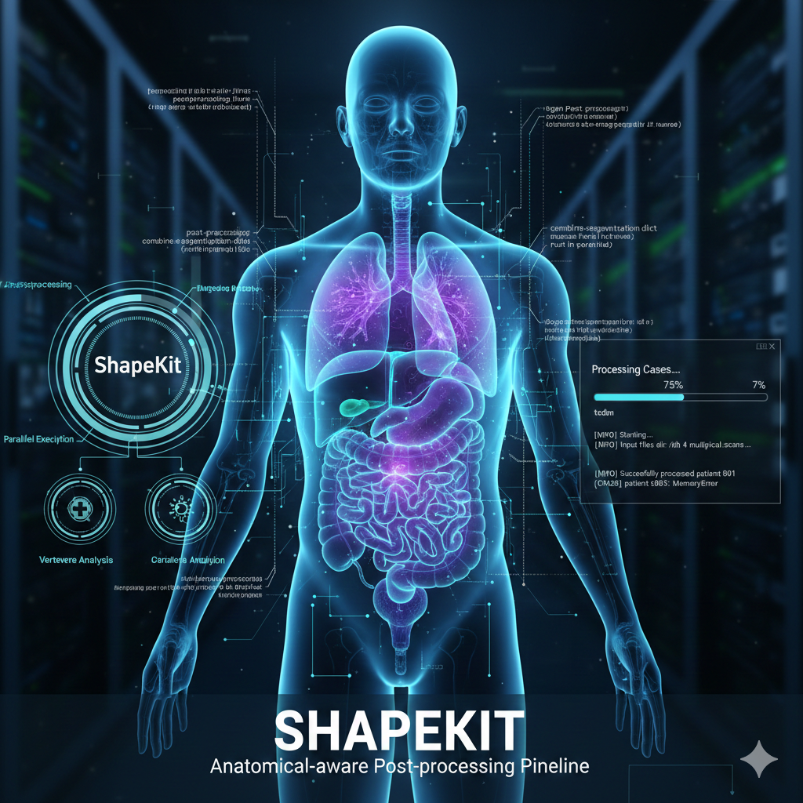

<!-- <h1 align="center">ShapeKit</h1> -->

<div align="center">
  
</div>

<!-- <div align="center">

 -->

<div align="center">


[](https://github.com/BodyMaps/ShapeKit/stargazers)
<a href="https://twitter.com/bodymaps317">
        
</a><br/>  

</div>

# Introduction
**ShapeKit** is a plug-and-play post-processing toolkit that enables researchers and clinicians to correct anatomical errors in AI-predicted segmentations without retraining models. It integrates seamlessly into existing pipelines and supports robust, anatomy-aware refinement across multiple organs and datasets.

Using a parallelized Python workflow, ShapeKit combines, calibrates, and refines multi-organ segmentations, leading to up to **15% improvement in Dice Similarity Coefficient (DSC)** and producing consistent outputs suitable for downstream analysis.

# Paper

<b>ShapeKit</b> <br/>
Junqi Liu*, Dongli He*, [Wenxuan Li](https://scholar.google.com/citations?hl=en&user=tpNZM2YAAAAJ), Ningyu Wang, [Alan Yuille](https://www.cs.jhu.edu/~ayuille/), [Zongwei Zhou](https://www.zongweiz.com/) <br/>
*Johns Hopkins University* <br/>
*Equal contribution. <br/>
MICCAI 2025 Workshop on Shape in Medical Imaging

<a href='https://www.zongweiz.com/dataset'></a> <a href='https://www.cs.jhu.edu/~zongwei/publication/liu2025shapekit.pdf'></a> <a href='http://www.cs.jhu.edu/~zongwei/poster/liu2025miccaiw_shapekit.pdf'></a>

# News & Updates

| Date | Description |
| :--- | :--- |
| **Dec 23, 2025** | 🎄 Added **Continue Prediction** option & improved **Print UI** |
| **Jul 30, 2025** | 🤖  **Vertebrae module** inaugurated and added to ShapeKit |
| **Jun 30, 2025** | 🚀 ShapeKit 1.0 Official Release|
  
# Installation

Clone the repository and install dependencies:

<!-- <details>
<summary style="margin-left: 25px;">[Optional 1] Install Anaconda on Linux</summary>
<div style="margin-left: 25px;"> -->
    
<!-- ```bash
wget https://repo.anaconda.com/archive/Anaconda3-2024.06-1-Linux-x86_64.sh
bash Anaconda3-2024.06-1-Linux-x86_64.sh -b -p ./anaconda3
./anaconda3/bin/conda init
source ~/.bashrc
```
</div>
</details>

<details>
<summary style="margin-left: 25px;">[Optional 2] Create A Virtual Environment</summary>
<div style="margin-left: 25px;">
    
```bash
conda create -n kit python=3.12 -y
conda activate kit
```
</div>
</details>

<details>
<summary style="margin-left: 25px;">[Optional 3] Merge Updates into Your Local Branch</summary>
<div style="margin-left: 25px;">

```bash
git fetch
git pull
```
</div>
</details> -->

```bash
git clone https://github.com/BodyMaps/ShapeKit.git
cd ShapeKit
while read requirement; do
    pip install "$requirement" || echo "Failed to install $requirement, skipping..."
done < requirements.txt
```

# Use ShapeKit
```bash
export inputs="/path/to/your/input/folder"
export outputs="/path/to/your/output/folder"
export CPU_NUM=16

python -W ignore main.py --input_folder $inputs --output_folder $outputs --cpu_count $CPU_NUM --continue_prediction
```

Or you can also use `sh bash.sh`.

<!-- > [!IMPORTANT]
> If the input data contains large CT segmentations (more than 1,000 slices), it’s best to keep `--cpu_count` below 32. -->

## Plug-and-Play Configuration ➡️
ShapeKit is designed to be *plug-and-play*. You don't need any coding knowledge to get started. Just tell the system which organs you are interested in by listing them in the `config.yaml` file.

<details>
<summary style="margin-left: 25px;">Check for details 🔍</summary>
<div style="margin-left: 25px;">

### How to choose your targets:

Simply open the `config.yaml`file and list the organs you want to process under target_organs. It’s as easy as checking boxes on a form.

```
# plug-and-play like Lego! choose organs for processing

target_organs: (example)
  - bladder
  - colon
  - duodenum
  - femur
  - intestine
  - kidney
  - liver
  - lung
  - pancreas
  - vertebrae
```

**<mark>For detailed configuration setting, please check [the config instructions 🌞](docs/config.md)</mark>.**.

Before running any commands, please ensure that `config.yaml` is properly configured. But don't worry! **Most of the configurations do not need to be changed at all.**
</details>

## Data Structure
The input and output files will be formated as [BodyMap form](https://huggingface.co/datasets/AbdomenAtlas/AbdomenAtlas1.0Mini/tree/main):
```
INPUT or OUTPUT
└── case_001
    ├── combined_labels.nii.gz (optional)
    └── segmentations
            ├── liver.nii.gz
            ...
            └── veins.nii.gz
```
> [!IMPORTANT] 
>  If you set outputs and inputs the same, the system will automatically overwrite the orginal folder.

# Key Functions
In addition to these general utilities, organ-specific correction functions are available in [organs_postprocessing.py](organs_postprocessing.py).

Please check the details in [functions guide book 📖.](docs/functions.md)


# Related Articles

```
@article{liu2025shapekit,
  title={ShapeKit},
  author={Liu, Junqi and He, Dongli and Li, Wenxuan and Wang, Ningyu and Yuille, Alan L and Zhou, Zongwei},
  journal={arXiv preprint arXiv:2506.24003},
  year={2025}
}
```

# Acknowledgement

This work was supported by the Lustgarten Foundation for Pancreatic Cancer Research, the Patrick J. McGovern Foundation Award, and the National Institutes of Health (NIH) under Award Number R01EB037669. We would like to thank the Johns Hopkins Research IT team in [IT@JH](https://researchit.jhu.edu/) for their support and infrastructure resources where some of these analyses were conducted; especially [DISCOVERY HPC](https://researchit.jhu.edu/research-hpc/). Paper content is covered by patents pending.
