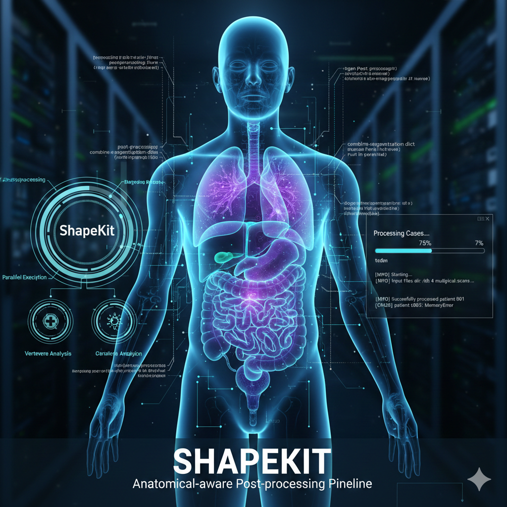

<!-- <h1 align="center">ShapeKit</h1> -->

<div align="center">
  
</div>

<!-- <div align="center">

 -->

<div align="center">


[](https://github.com/BodyMaps/ShapeKit/stargazers)
<a href="https://twitter.com/bodymaps317">
        
</a><br/>  

</div>

# Introduction
**ShapeKit** is a plug-and-play post-processing toolkit that enables researchers and clinicians to correct anatomical errors in AI-predicted segmentations without retraining models. It integrates seamlessly into existing pipelines and supports robust, anatomy-aware refinement across multiple organs and datasets.

Using a parallelized Python workflow, ShapeKit combines, calibrates, and refines multi-organ segmentations, leading to up to **15% improvement in Dice Similarity Coefficient (DSC)** and producing consistent outputs suitable for downstream analysis.

# Paper

<b>ShapeKit</b> <br/>
[Junqi Liu*](https://kumakuma2002.github.io/), Dongli He*, [Wenxuan Li](https://scholar.google.com/citations?hl=en&user=tpNZM2YAAAAJ), Ningyu Wang, [Alan Yuille](https://www.cs.jhu.edu/~ayuille/), [Zongwei Zhou](https://www.zongweiz.com/) <br/>
*Johns Hopkins University* <br/>
*Equal contribution. <br/>
MICCAI 2025 Workshop on Shape in Medical Imaging

<a href='https://www.zongweiz.com/dataset'></a> <a href='https://www.cs.jhu.edu/~zongwei/publication/liu2025shapekit.pdf'></a> <a href='http://www.cs.jhu.edu/~zongwei/poster/liu2025miccaiw_shapekit.pdf'></a>
  
# Installation

To set up environment, see [INSTALL.md](https://github.com/BodyMaps/ShapeKit/blob/main/docs/INSTALL.md) for details.

```bash
git clone https://github.com/BodyMaps/ShapeKit.git
cd ShapeKit
pip install -r requirements.txt
```

# Use ShapeKit

<details>
<summary style="margin-left: 25px;">Organize your data</summary>
<div style="margin-left: 25px;">
    
```bash
INPUT or OUTPUT
└── case_001
    ├── combined_labels.nii.gz (optional)
    └── segmentations
            ├── liver.nii.gz
            ...
            └── veins.nii.gz
```
</div>
</details>

```bash
export INPUT="/path/to/your/input/folder"
export OUTPUT="/path/to/your/output/folder"
export CPU_NUM=16
export LOG="logs/folder_named_after_your_task"

python -W ignore main.py --input_folder $INPUT --output_folder $OUTPUT --cpu_count $CPU_NUM --log_folder $LOG --continue_prediction
```

The processing process will be recorded as `debug.log` and `postprocessing.log`,and are stored under the directory `LOG`.

# Plug-and-Play Configuration
Tell ShapeKit which anatomical structures you are interested in by modifying the `config.yaml` file.

<details>
<summary style="margin-left: 25px;">Check for details 🔍</summary>
<div style="margin-left: 25px;">

### How to choose your interested anatomical structures:

Open the `config.yaml`file and list the anatomical structures you want to process under `target_organs`. It’s as easy as checking boxes on a form.

```
# plug-and-play like Lego! choose organs for processing

target_organs: (example)
  - bladder
  - colon
  - duodenum
  - femur
  - intestine
  - kidney
  - liver
  - lung
  - pancreas
  - vertebrae
```

**<mark>For detailed configuration setting, please check [the config instructions 🌞](docs/config.md)</mark>.**.

Before running any commands, please ensure that `config.yaml` is properly configured. But don't worry! **Most of the configurations do not need to be changed at all.**
</details>

# Evidence-Gated Vertebrae Engine (ShapeKit-Pro)

The default vertebrae module works from the masks alone. ShapeKit can now
optionally repair vertebrae against the case **CT image** with an
evidence-gated engine that **recolors label errors inside the prediction
envelope instead of deleting bone**:

- fragments are re-attached through CT-certified bone corridors, never
  discarded when they are real bone;
- level-band mass misassignment (e.g. a collapsed L1 split between
  neighbors) is re-arbitrated at image-detected disc planes;
- the posterior arch is rebuilt from pedicle roots, and one-level-down
  spinous chains on fused spines are repaired by a caudal-flow
  re-derivation;
- every risky stage carries its own defect meter and **reverts itself**
  when it cannot prove improvement, so one parameter set is safe across
  clean and pathological cases at scale.

Enable it in `config.yaml`:

```yaml
vertebrae_engine: shapekit_pro   # default: shapekit_songlin (existing module)
ct_file_name: ct.nii.gz          # looked up inside each input case folder
# ct_root: /path/to/ct/cases     # fallback root when CTs live elsewhere
```

No new dependencies (numpy, scipy, nibabel, scikit-image and
connected-components-3d are already required). CPU only; ~2 min for a
2.5 mm case and ~30 min for a 0.7 mm whole-spine case on 2 cores, with a
peak of roughly 9 GB on the latter — budget `--cpu_count` accordingly.
When a case has no reachable CT the engine logs it and falls back to the
default vertebrae module, so batch runs never stall.

Measured on the AbdomenAtlasDemo cases (identical parameters, per-stage QA
and verification tooling in the
[ShapeKit-Pro repository](https://github.com/aj-das-research/jhu-bodymaps-warmup)):
both cases reach zero structural audit flags (fragmentation, ordering,
size, emptiness; exactly 24 components), the collapsed L1 is restored from
23.3 to 62.9 cm3 at detected disc planes, and every spinous process is
re-attached to its own vertebra on the fused case.

# Iterative Vertebrae Engine (ShapeKit-Iterative)

In addition to the default and Pro vertebrae engines, ShapeKit now offers a
**VerSe-inspired iterative refinement** module that runs an anatomic
consistency cycle on the predicted vertebrae masks alone (no CT required):

- **residual reassignment** — recovers unassigned spine voxels and
  reassigns them to the nearest vertebra by 3D centroid distance;
- **gap detection & filling** — detects anomalously large Z-axis gaps
  between consecutive vertebrae and assigns residual components to the
  missing level;
- **fishing for boundary vertebrae** — extrapolates beyond the detected
  inferior/superior boundaries to recover L5 or C1 when missing;
- **duplicate removal** — merges overlapping detections via IoU thresholding;
- **anatomical size consistency** — validates vertebrae sizes against
  region-group medians (lumbar > thoracic > cervical) and removes outliers;
- **iterative convergence** — repeats the full clean → reassign → fill →
  reallocate loop until the change rate drops below 1% or max iterations
  (3) are reached.

This module is adapted from Meng et al., "Vertebrae localization,
segmentation and identification using a graph optimization and an
anatomic consistency cycle" (2022,
[https://gitlab.inria.fr/spine/vertebrae_segmentation](https://gitlab.inria.fr/spine/vertebrae_segmentation)).

It is the default option in `config.yaml`:

```yaml
vertebrae_engine: shapekit_songlin   # default option for vertebrae processing
```

No CT image is needed — the module works from prediction masks alone.
Output is compatible with the existing 26-based label scheme
(26 = L5 … 49 = C1). Verified to produce identical results to the
SuPreM standalone postprocessing pipeline on the AbdomenAtlasDemo
benchmark cases.

# Anchor-and-Slab Vertebrae Engine (ShapeKit-Anchor)

A fourth vertebrae option that starts from a different observation: the
network is much better at *finding* vertebrae than at *naming* them.
Localisation is a local texture problem, naming means counting from a
landmark that is often outside the field of view. So instead of repairing
labels one at a time, the engine re-derives the naming from the geometry of
what the network found.

- **Clean spine** (one body per label, consistent order): bodies are ranked
  along the spine axis and renumbered with one integer offset chosen to
  agree with the network's own votes. A spine the network named correctly
  comes back unchanged, cleaned of islands and soft-tissue leakage.
- **Scrambled spine** (repeated labels, split or merged bodies, names running
  backwards): the component count carries no information, so the engine
  finds the *anchors*, the levels the network got right (one body per label,
  plausible volume, on a smooth curve of position against level), fits that
  curve, reads off where every other level must sit, and cuts the spine mask
  into slabs between anchors. Cuts are placed by volume share (each rebuilt
  level gets its expected fraction of the volume between anchors) and
  snapped to the mask waist at the disc where one exists. Anchors keep the
  network's own boundary.
- **Boundaries**: a balanced watershed lets thoracic levels take back the
  posterior elements a planar cut hands to the level below, and a one-voxel
  Gaussian argmax removes the resampling staircase. Optionally, on a GPU,
  the planar boundary of each rebuilt level is replaced by a learned one
  from [nnInteractive](https://github.com/MIC-DKFZ/nnInteractive), prompted
  once at the position the resolver found. Anchors are never prompted.
- **Honest failure**: when there are too few reliable levels to fit the
  position model, the engine keeps the network's names and writes
  `NEEDS_REVIEW` to the log rather than guessing. When the aorta and
  celiac trunk are also segmented, their implied naming is compared with
  the network's and a disagreement is flagged the same way.

Everything geometric is computed in millimetres from the affine, never in
voxels, so thresholds keep their meaning across slice thicknesses.

Enable it in `config.yaml`:

```yaml
vertebrae_engine: shapekit_anchor
ct_file_name: ct.nii.gz          # optional: enables the bone check and the prompt stage
# ct_root: /path/to/ct/cases     # fallback root when CTs live elsewhere
vertebrae_prompt_model: none     # or nninteractive (GPU, pip install nninteractive)
```

No new required dependencies (numpy, scipy, nibabel and
connected-components-3d are already required). CPU only by default: the
engine takes about 35 s on a 2.5 mm abdominal case and about 2.5 min on a
0.7 mm whole-spine case on one core, and adds about 2 GB above the masks
ShapeKit already holds, because it crops to the vertebrae bounding box
before any per-label pass (the 24 full-size masks themselves are about 9 GB
on the 0.7 mm case, so budget `--cpu_count` by that). The optional prompt
stage needs a CUDA GPU with 8 to 10 GB free and adds about a minute per
rebuilt spine; run with `--cpu_count 1` when it is on so that only one copy
of the model is loaded. A missing CT, package or GPU is logged and the CPU
result is returned, so batch runs never stall.

Measured on the AbdomenAtlasDemo cases in the BodyMaps warm-up evaluation
(human-revised labels, mean DSC over 24 levels): a conservative first
version that kept the network's names whenever the component count could
not be trusted scored 76.7%, with L2 to T5 between 20% and 50% on the
scrambled case; this engine scored 92.8%, every level at or above 90.0%
(worst T9 90.0%, best L5 96.7%). Running the engine through `main.py` on
the same inputs reproduces that evaluated output: the correctly named case
comes back byte-identical, and the scrambled case differs in 6 of 1.43
million foreground voxels with the prompt stage on. See
`tests/test_vertebrae_anchor.py` for the synthetic suite ( islands,
duplicate names, swaps, dropouts, shuffles, an unfixable global shift that
must be left alone, soft-tissue leakage, the thoracolumbar split-and-merge
failure, a tapered spine, a partial field of view, and the ShapeKit adapter
round trip).

# Key Functions
In addition to these general utilities, anatomical-structures-specific correction functions are available in [organs_postprocessing.py](organs_postprocessing.py).

Please check the details in [functions guide book 📖.](docs/functions.md)

# Related Articles

```
@article{liu2025shapekit,
  title={ShapeKit},
  author={Liu, Junqi and He, Dongli and Li, Wenxuan and Wang, Ningyu and Yuille, Alan L and Zhou, Zongwei},
  journal={arXiv preprint arXiv:2506.24003},
  year={2025}
}
```

# Acknowledgement

This work was supported by the Lustgarten Foundation for Pancreatic Cancer Research, the Patrick J. McGovern Foundation Award, and the National Institutes of Health (NIH) under Award Number R01EB037669. We would like to thank the Johns Hopkins Research IT team in [IT@JH](https://researchit.jhu.edu/) for their support and infrastructure resources where some of these analyses were conducted; especially [DISCOVERY HPC](https://researchit.jhu.edu/research-hpc/). Paper content is covered by patents pending.
