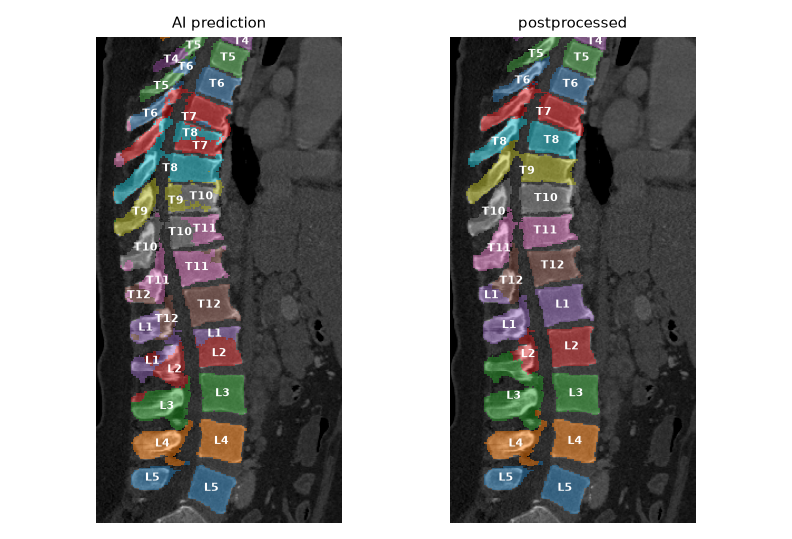
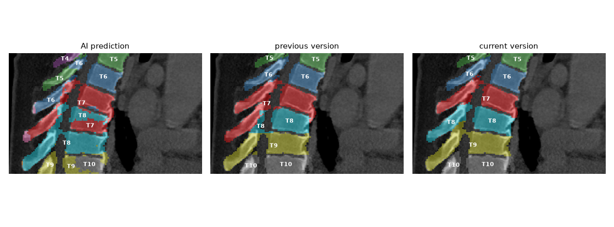

# Anatomical re-identification vertebrae engine (ShapeKit-Aaron)

`shapekit_aaron` integrates Aaron Ajit's warm-up solution as an opt-in vertebrae
engine. It works from the predicted masks alone (no CT) and does not change the
default `shapekit_songlin` engine.

- `utils/vertebrae_aaron_engine.py` is the standalone warm-up script. Compared with
  the evaluated submission, step A now grows the kept spine as a chain (see below);
  on the two demo cases the output is voxel-identical to the submission.
- `utils/vertebrae_aaron.py` adapts the ShapeKit segmentation dict (ids 26–49) to
  the engine's label volume (1 = L5 … 24 = C1) and back.

## Method

The engine runs on a closest-canonical (RAS) copy of the vertebra labels, so it
works for any voxel orientation.

- **A. Keep the spine.** Starting from the largest connected component, every
  component of at least 2 ml within 10 mm of what is already kept is kept; the
  rest (e.g. "C1" blobs in the femur) is removed.
- **B. Body cores.** A 5 mm erosion removes the thin posterior elements and the
  contacts at discs and facets, leaving one core per vertebral body. Cores that
  still hold two bodies are split by further erosion.
- **C. Identification.** Cores are ordered from inferior to superior, and dynamic
  programming assigns them strictly increasing labels. The score rewards agreement
  with the AI labels and penalizes label steps that do not match the measured
  distance between cores. This fixes runs shifted by one level and labels used on
  two vertebrae.
- **D. Relabeling.** Each core is grown back to its body, which gets one label.
  Each posterior-element voxel then takes the label of the body it connects to
  through the pedicles: the body reached by the cheapest path inside the mask,
  with paths made expensive through thin bone and across AI label boundaries.
  Vertebrae without an identified body keep their AI labels.
- **E. Cleanup.** One connected piece per label; detached pieces go to the
  neighbor they touch; enclosed holes are filled.





## Usage

```bash
python -W ignore main.py --input_folder $INPUT --output_folder $OUTPUT \
    --cpu_count $CPU_NUM --log_folder $LOG \
    --vertebrae_engine shapekit_aaron --vertebrae_only
```

or set `vertebrae_engine: shapekit_aaron` in `config.yaml`. The engine needs only
the vertebra masks; other organs are processed by ShapeKit as usual. Each case
logs its changes to `debug.log` with the prefix `[ShapeKit-Aaron]`.

Use **original AI predictions** as input. The engine is not idempotent: run on its
own output, it still moves voxels between neighbors (Limitations).

## Validation

- The BodyMaps warm-up evaluation reported a mean DSC of 93.4% over the 24
  vertebrae on the two AbdomenAtlasDemo cases for the standalone submission.
  That is two cases, not a validation on a new dataset.
- Through `main.py`, `shapekit_aaron` reproduces the standalone output voxel for
  voxel on both demo cases.
- `tests/test_vertebrae_aaron.py` checks, on a synthetic spine, that a duplicated
  label is resolved into L5 → C1 order, that the result does not depend on voxel
  orientation, that other organs are untouched, and that a vertebra cut off at the
  edge of the scan keeps its AI label:

  ```bash
  python -m pip install pytest
  python -m pytest tests/test_vertebrae_aaron.py -q
  ```

Runtime (engine only, one core): about 1.5 min for case 006 (2.5 mm slices) and
4.5 min for case 031 (0.7 mm slices). No new dependencies.

## Limitations

- **12 thoracic + 5 lumbar vertebrae are assumed.** Variants (6 lumbar, 11 thoracic,
  lumbarized S1) would be forced into the 24-label sequence.
- **Cervical and cut-off vertebrae keep the AI labels.** Their eroded cores are too
  small to define a vertebra reliably, so they are cleaned but not re-identified.
- **Posterior elements depend on the AI's partition.** In case 031 the L2 spinous
  process, which hangs down to the L2/L3 disc, is labeled L3.
- **Not idempotent.** Path costs depend on the input labels; a second pass changes
  680 voxels in case 006 and about 12,000 in case 031.
- **Ribs are not handled.**
